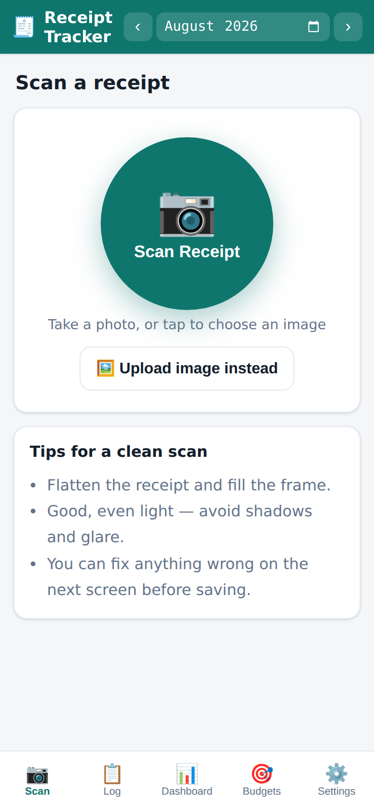
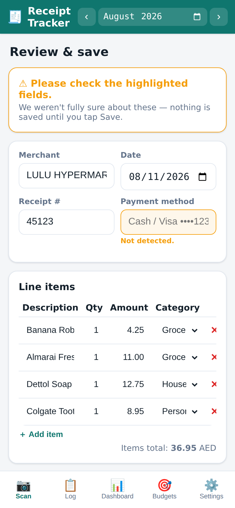
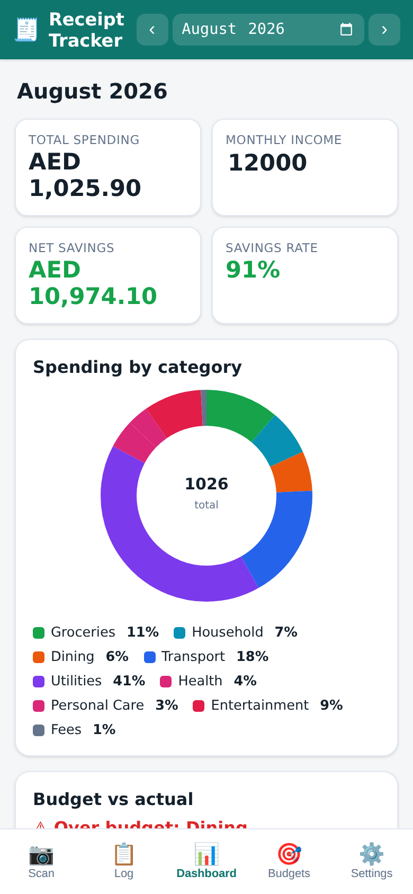
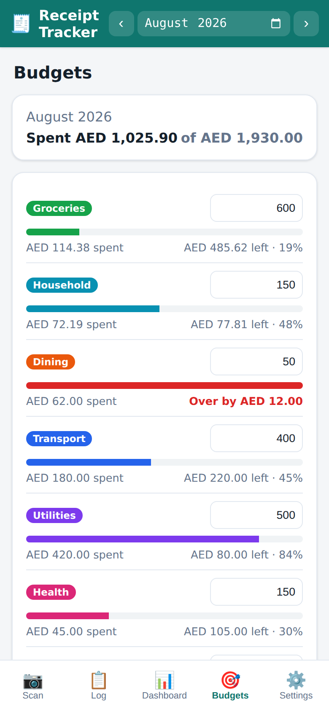

# 🧾 Receipt Tracker

[](https://github.com/amitrayamajhi/receipts/actions/workflows/ci.yml)
[](LICENSE)


Snap a photo of a receipt and get a categorised expense log, monthly budgets
and a spending dashboard. It all runs **in your browser, on your device**:
no account, no server, no cloud. Built with the UAE in mind (AED, 5% VAT,
Lulu / Carrefour / ADNOC / DEWA, Happiness Points), but the currency is
configurable.

**Try it:** **https://amitrayamajhi.github.io/receipts/** (open it on your phone and add it to your home screen)

| Scan | Review | Dashboard | Budgets |
| :---: | :---: | :---: | :---: |
|  |  |  |  |

## Features

- **On-device OCR.** Take a photo (or upload one) and
  [Tesseract.js](https://github.com/naptha/tesseract.js) reads it locally. No
  image ever leaves your phone.
- **Smart parsing.** It pulls out the store, date, receipt number, line items
  with quantities, subtotal, VAT, total, payment card (`Visa ••••1234`) and
  loyalty points. Anything it's unsure about is highlighted for you to check
  before saving.
- **Auto-categorisation** into 12 categories (Groceries, Dining, Transport,
  Utilities…). It **learns from your corrections**: change a category once and
  it remembers next time.
- **Budgets** per category with progress bars and over-budget warnings.
- **Dashboard** with total spending, income, savings rate, a category donut,
  budget-vs-actual bars, VAT paid and loyalty-point value.
- **Expense log** you can sort, filter and edit inline.
- **Excel export** with three sheets: the log, a **live-formula** dashboard
  (edit a number and it recalculates) and instructions. **CSV** export and
  import too, for backups.
- **Installable and offline.** Add it to your home screen and it works like an
  app, including with no internet.

## Use it

### On your phone

Open **https://amitrayamajhi.github.io/receipts/**, then:
- **iPhone (Safari):** Share → **Add to Home Screen**
- **Android (Chrome):** ⋮ menu → **Install app**

### On your computer

The app has to be opened through a small local web server. Browsers block the
camera, OCR and offline mode for files opened directly. You need
[Python 3](https://www.python.org/downloads/).

- **Windows:** double-click **`Start Receipt Tracker.bat`**
- **Mac / Linux:** run `./start.sh` in a terminal

Either one opens <http://localhost:8770/>. Keep the window open while you use
the app.

## Your data

Everything is stored in your browser's IndexedDB on that device. Nothing is
uploaded anywhere. That also means **clearing your browser data deletes your
receipts**, so use **Settings → Export .csv** now and then as a backup. You
can import it again on any device.

## Hosting

The app is hosted free on GitHub Pages straight from the `main` branch
(**Settings → Pages → Deploy from a branch → `main` / root**), so every push
to `main` updates the live site within a minute or two. Each person who opens
the link keeps their own data on their own device. Hosting only serves the
app's files.

## How it works

```
photo ──► ocr.js (Tesseract, in a Web Worker) ──► raw text
      ──► parser.js ──► fields + line items + "please check" flags
      ──► categorize.js (your learned corrections → keyword rules → store type)
      ──► review screen (you fix anything) ──► db.js (IndexedDB)
      ──► log / dashboard / budgets / export
```

| Path | What it does |
| --- | --- |
| `index.html`, `css/`, `js/app.js` | App shell, tab bar and router |
| `js/parser.js` | Turns messy OCR text into a structured receipt (pure, tested) |
| `js/rules.js`, `js/categorize.js` | Category keywords and matching. Edit `rules.js` to add your own |
| `js/spending.js` | What a receipt actually cost, including VAT not listed as items (pure, tested) |
| `js/db.js` | IndexedDB storage for receipts, budgets, income, settings and learned categories |
| `js/exporter.js` | Excel (3 sheets) and CSV export, and CSV import |
| `js/charts.js` | Small hand-written SVG charts, no chart library |
| `js/screens/` | One file per screen |
| `sw.js`, `manifest.webmanifest` | Offline cache and home-screen install |
| `vendor/` | Tesseract.js (OCR engine + English data, ~31 MB) and SheetJS, bundled so it works offline |
| `tests/` | Unit tests for the parser, spending rules, export/import and helpers |

There's no build step and no dependencies to install. The app is plain HTML,
CSS and JavaScript modules.

## Development

```bash
./start.sh     # or: npm start    → http://localhost:8770/
npm test       # runs the tests with Node's built-in runner (Node 18+)
```

GitHub Actions runs the tests on every push. When you add files the app needs
offline, list them in `ASSETS` in `sw.js` and bump the `CACHE` version.

## Roadmap

- Recurring expenses (rent, subscriptions) without a receipt
- Arabic receipt support (Tesseract `ara` language data)
- Month-to-month trend chart
- Optional encrypted sync between devices

## Credits

- [Tesseract.js](https://github.com/naptha/tesseract.js) and the Tesseract
  `eng` language data: Apache License 2.0
- [SheetJS Community Edition](https://sheetjs.com) 0.18.5: Apache License 2.0

## License

[MIT](LICENSE) © Amit Rayamajhi
